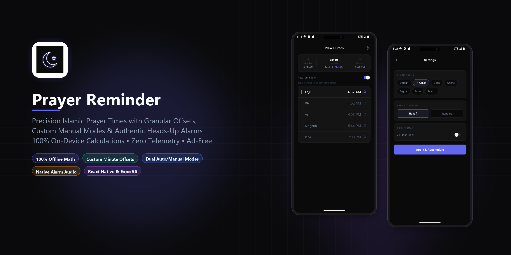
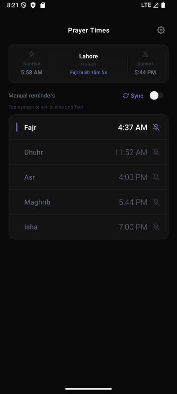
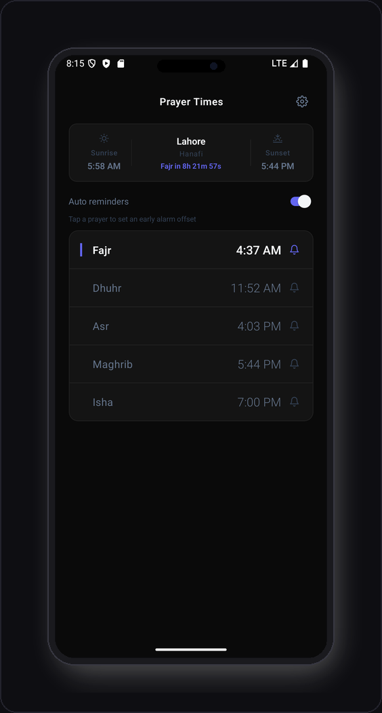
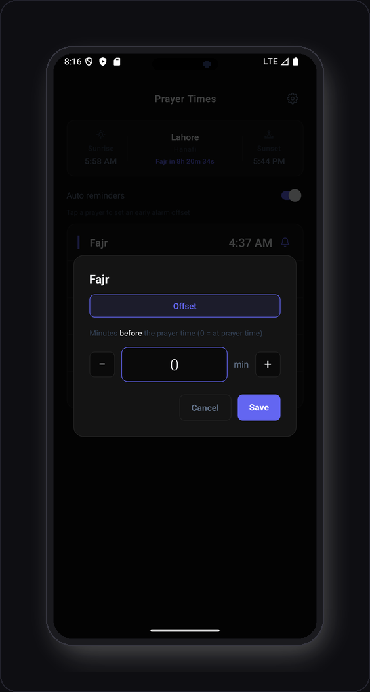
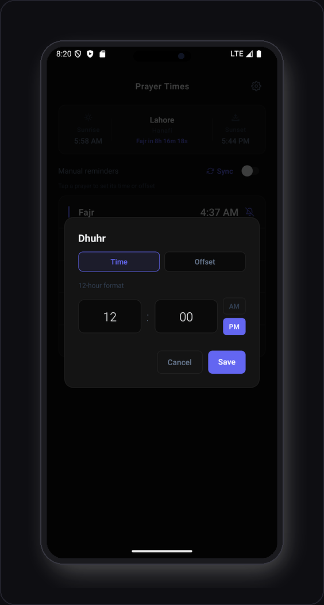
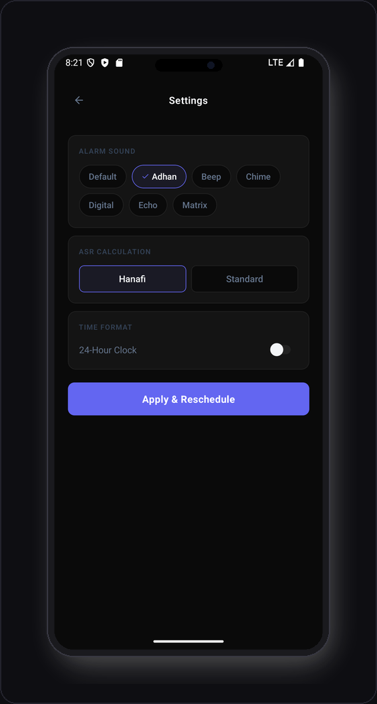
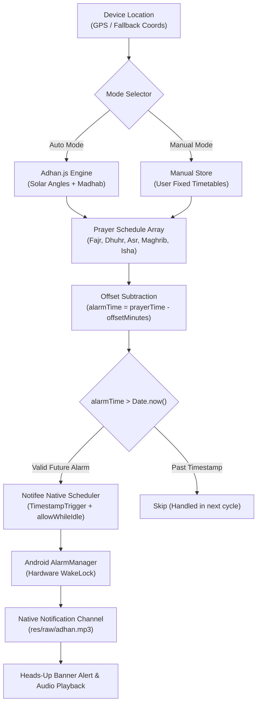

# 🕌 Prayer Reminder - Precision Islamic Prayer Times with Granular Offsets

> Precision prayer schedules with per-prayer minute offsets, dual Auto/Manual modes, authentic native Adhan soundboard, and 100% on-device astronomical calculations. Zero telemetry. No ads. Free & Open Source.

[]()
[](LICENSE)
[]()
[]()
[]()
[]()
[]()
[]()
[]()
[]()

---

## 📥 Download & How to Install

### Quick Download
👉 **[Download Pre-Built Release APK (app-release.apk)](https://github.com/haichteque/prayer-reminder/releases/latest)**  
*Standalone, installable Android APK package. Works offline immediately on any modern Android device (Android 8.0+).*

### Method 1: Install Pre-Built APK (Recommended)
1. Download [`app-release.apk`](https://github.com/haichteque/prayer-reminder/releases/latest) to your Android device.
2. Tap the downloaded file in your device's Downloads or File Manager.
3. If prompted, allow your browser or file manager permission to *"Install unknown apps"*.
4. Tap **Install** and open **Prayer Reminder** (🕌).
5. Grant Location and Notification / Exact Alarm permissions on the first launch so that alarms can be accurately scheduled.

### Method 2: Build & Install from Source
If you are developing, adding custom adhan audio, or customizing calculation algorithms:

```bash
# 1. Clone repository
git clone https://github.com/haichteque/prayer-reminder.git
cd prayer-reminder

# 2. Install dependencies
npm install

# 3. Generate native Android project with custom audio plugins
npx expo prebuild -p android --clean

# 4. Build and install directly onto a connected device or emulator
npx expo run:android

# Or compile a standalone release APK directly via Gradle:
cd android
./gradlew assembleRelease
# The APK will be generated at android/app/build/outputs/apk/release/app-release.apk
```

---

## 💡 Why Prayer Reminder?

Most Islamic prayer applications suffer from a rigid notification paradigm: they notify you *exclusively at the exact astronomical moment* the Azaan takes place.

**Prayer Reminder** solves real-world daily worship challenges:

- **Per-Prayer Granular Offsets**: Need 15 minutes before Fajr to wake up and perform Wudu? Need 10 minutes before Maghrib to prepare your Iftar? Set independent minus-minute offsets for each individual prayer.
- **Dual Auto & Manual Modes**: Rely on high-precision astronomical solar algorithms (`adhan`) in **Auto Mode**, or switch to **Manual Mode** to lock down fixed clock times (e.g. 1:30 PM Dhuhr) matching your local masjid's static Jama'at schedule.
- **100% On-Device & Offline**: Prayer times are calculated astronomically directly on your phone's processor using geographic coordinates. No server requests, no internet connection required for daily use.
- **Privacy & Zero Telemetry**: Your GPS coordinates stay strictly on your device. Zero analytics, zero advertising SDKs, zero background trackers.
- **Reliable 7-Day Exact Alarms**: Powered by `@notifee/react-native` and Android's native `AlarmManager` with `allowWhileIdle: true`, ensuring your notifications fire reliably even during Android's deep Doze power-saving state.

---

## 🎬 Demo



---

## 📊 Comparison Matrix

| Capability / Feature | Stock Clock / Alarms | Traditional Prayer Apps | **Prayer Reminder** |
|:---|:---:|:---:|:---|
| **On-Device Astronomical Math** | ❌ None | ⚠️ Often requires cloud API | **✔ 100% Local (Adhan.js)** |
| **Per-Prayer Minute Offsets** | ❌ Manual alarms only | ❌ Global offset only or none | **✔ Independent -/+ per prayer** |
| **Dual Modes (Auto vs Manual)** | ❌ None | ❌ Solar calculations only | **✔ Switch between Solar & Fixed** |
| **Authentic Adhan & Soundboard** | ❌ System ringtones | ⚠️ Restricted or paywalled | **✔ 6 Native Sounds (Adhan, Echo, etc.)** |
| **Non-Intrusive Heads-Up Alerts** | ⚠️ Screen takeover alarms | ⚠️ Fullscreen intrusive popups | **✔ High-Priority Heads-Up Banner** |
| **7-Day Exact Alarm Scheduling** | ❌ Single recurring | ⚠️ Prone to Doze killing | **✔ Exact Alarms (allowWhileIdle)** |
| **Privacy & Telemetry** | ✔ Private | ❌ Heavy ad networks & tracking | **✔ 100% On-Device (Zero Telemetry)** |
| **Advertisements & Bloat** | ✔ None | ❌ Banner ads, video popups | **✔ 100% Clean & Ad-Free** |
| **License & Price** | Closed source | Freemium / Subscription | **✔ Free & Open Source (MIT)** |

---

## 🖼️ Interface Showcase

| Active Countdown & Schedule | Granular Offset Adjuster |
|:---:|:---:|
|  |  |
| *Real-time countdown timer to the next prayer, active location display, mode switch, and full daily prayer timetable* | *Tap any prayer row in Auto Mode to configure individual minute offsets (-/+), alerting you ahead of time* |

| Manual Fixed-Time Editor | Settings & Audio Soundboard |
|:---:|:---:|
|  |  |
| *Intuitive time picker for setting static Jama'at times per prayer, ideal for masjids with fixed prayer clocks* | *Madhab juristic selection (Hanafi / Shafi'i), 12h/24h toggle, and custom native audio soundboard* |

---

## 🚀 Features

### ⏱️ Per-Prayer Granular Offsets
- **Custom Alert Windows**: Ring alarms 5, 10, 15, or 30 minutes *before* any prayer time without affecting other prayers.
- **Smart Notification Text**: Alarms reflect offsets dynamically (e.g., *"Fajr Prayer (in 15 min)"*).
- **One-Tap Offset Reset**: Reset back to standard Azaan time with a single tap.

### 🔄 Dual Operation Modes
- **Auto Mode (Astronomical Solar Engine)**: Computes Fajr, Sunrise, Dhuhr, Asr, Sunset, Maghrib, and Isha based on precise geographic coordinates and solar elevation angles.
- **Manual Mode (Fixed Timetable)**: Perfect for users who follow their local mosque's fixed Jama'at times. Configure custom hours and minutes per prayer with persistent state.

### 🌙 Authentic Adhan & Native Soundboard
- **High-Fidelity Audio**: Includes recorded authentic Adhan along with modern notification tones (`Echo`, `Matrix`, `Chime`, `Beep`, `Digital`).
- **Android Notification Channels**: Injects audio directly into native `res/raw` channels with high importance and lockscreen visibility.
- **In-App Sound Auditioning**: Tap to preview any sound directly in Settings before setting it as your active alarm.

### ⚡ Robust Background Scheduling
- **7-Day Rolling Horizon**: Pre-schedules all 5 daily prayers for a full 7 days in advance.
- **Deep Doze Resilience**: Uses Android's `AlarmManager` with `allowWhileIdle: true` and `USE_EXACT_ALARM` permissions to ensure alarms trigger even when the screen has been off for hours.
- **Reboot & Reschedule**: Recomputes and re-arms triggers automatically whenever preferences, location, or offsets change.

### 🧭 Juristic Asr Methods & Global Support
- **Hanafi & Shafi'i Asr Calculations**: Toggle between standard shadow length ratios (Shafi'i/Maliki/Hanbali: 1x shadow; Hanafi: 2x shadow).
- **Muslim World League Standard**: Globally validated calculation method.
- **12-Hour & 24-Hour Formats**: Toggle between standard AM/PM format and military 24-hour time across all displays and countdowns.

---

## 🛠️ Architecture & Notification Pipeline



---

## 🧰 Tech Stack

| Technology | Purpose |
|---|---|
| [React Native 0.85](https://reactnative.dev/) | Cross-platform native mobile runtime |
| [Expo 56](https://expo.dev/) | Modern developer framework and native configuration plugins |
| [Adhan.js](https://github.com/batoulapps/adhan-js) | Precise on-device astronomical prayer calculations |
| [@notifee/react-native](https://notifee.app/) | Exact Android notification triggers, wake locks, and sound channels |
| [Zustand](https://github.com/pmndrs/zustand) | Fast, lightweight global state with `AsyncStorage` persistence |
| [Expo Audio](https://docs.expo.dev/versions/latest/sdk/audio/) | Low-latency in-app sound auditioning and playback |
| [React Navigation 7](https://reactnavigation.org/) | Native stack navigation between Home and Settings screens |
| [Custom Config Plugins](file:///D:/Projects/prayer-reminder/withAndroidSounds.js) | Injects `.mp3` and `.wav` sounds into Android `res/raw` during prebuild |

**Zero backend servers. Zero advertising networks. Zero telemetry. 100% on-device.**

---

## 📂 Project Structure

```text
prayer-reminder/
├── assets/
│   ├── icon.png                     # Application icon
│   ├── splash-icon.png              # Splash screen asset
│   └── sounds/                      # Native audio files
│       ├── adhan.mp3                # Authentic Adhan recording
│       ├── beep.wav                 # Beep notification tone
│       ├── chime.wav                # Chime alert
│       ├── digital.wav              # Digital alarm sound
│       ├── echo.wav                 # Echo notification
│       └── matrix.wav               # Matrix synth alert
├── demo/
│   └── images/                      # Documentation graphics & showcase
│       ├── cover.png                # High-resolution README banner
│       ├── demo.gif                 # Animated demo walkthrough
│       ├── home-screen.png          # Framed Home view card
│       ├── offset-modal.png         # Framed Offset Adjuster card
│       ├── manual-editor.png        # Framed Manual Editor card
│       └── settings-screen.png      # Framed Settings card
├── scripts/
│   └── generate-demo-assets.py      # Automated frame processing & GIF builder
├── src/
│   ├── screens/
│   │   ├── HomeScreen.tsx           # Countdown, prayer list, mode toggle, offset modals
│   │   └── SettingsScreen.tsx       # Soundboard audition, madhab, 24h clock toggle
│   ├── services/
│   │   ├── NotificationService.ts   # Notifee exact alarm manager & channel configuration
│   │   └── PrayerTimeService.ts     # Adhan.js calculation engine wrapper
│   └── store/
│       └── useSettingsStore.ts      # Zustand persistent settings store
├── withAndroidSounds.js             # Expo config plugin syncing sounds to res/raw
├── withNotifeeMaven.js              # Expo config plugin configuring Notifee maven repo
├── withProguard.js                  # Proguard keep rules for Kotlin reflection
├── withKotlinReflect.js             # Config plugin resolving Kotlin runtime reflection
├── app.json                         # Expo configuration, permissions, and plugin definitions
├── eas.json                         # EAS build profiles (including production-apk)
└── package.json                     # Dependencies and build scripts
```

---

## 🎵 Adding Custom Adhan & Alarm Sounds

You can effortlessly add custom `.mp3` or `.wav` Azaan recordings or alarm tones:

1. **Add Sound File**: Drop your `.mp3` or `.wav` file into `assets/sounds/` (e.g. `assets/sounds/custom_adhan.mp3`). Use lowercase names with underscores only (Android resource naming convention).
2. **Register Sound**: Add your sound's key to the sounds list in [`src/screens/SettingsScreen.tsx`](file:///D:/Projects/prayer-reminder/src/screens/SettingsScreen.tsx):
   ```typescript
   const SOUND_OPTIONS = [
     { id: 'adhan', label: 'Adhan (Authentic)' },
     { id: 'custom_adhan', label: 'My Custom Adhan' },
     // ...
   ];
   ```
3. **Run Prebuild**:
   ```bash
   npx expo prebuild -p android --clean
   ```
   The custom [`withAndroidSounds.js`](file:///D:/Projects/prayer-reminder/withAndroidSounds.js) plugin will automatically copy the file into `android/app/src/main/res/raw/`.
4. **Rebuild the App**: Build with `npx expo run:android` or `./android/gradlew assembleRelease`.

---

## 🔨 Building & Development

### Prerequisites
- [Node.js](https://nodejs.org/) (v18 or newer)
- [Android Studio](https://developer.android.com/studio) with Android SDK and command-line tools
- JDK 17+

### Option A: Local Development Run
```bash
# Start on connected Android device or running emulator
npx expo run:android
```

### Option B: Compile Standalone Release APK
```bash
# Prebuild native code
npx expo prebuild -p android --clean

# Assemble release APK via Gradle
cd android
./gradlew assembleRelease

# Output APK path:
# android/app/build/outputs/apk/release/app-release.apk
```

### Option C: Cloud Build via EAS
```bash
# Build standalone installable APK on Expo cloud infrastructure
npx eas-cli build -p android --profile production-apk
```

---

## 👥 Credits & Attribution

- **[Adhan.js](https://github.com/batoulapps/adhan-js)**: High-precision astronomical prayer calculation algorithms developed by [Batoul Apps](https://batoulapps.com/).
- **[Notifee](https://notifee.app/)**: Native notification library for React Native by [Invertase](https://invertase.io/).
- **[Expo](https://expo.dev/)**: Universal React application framework.

---

## 📄 License

This project is open source and licensed under the [MIT License](LICENSE).
